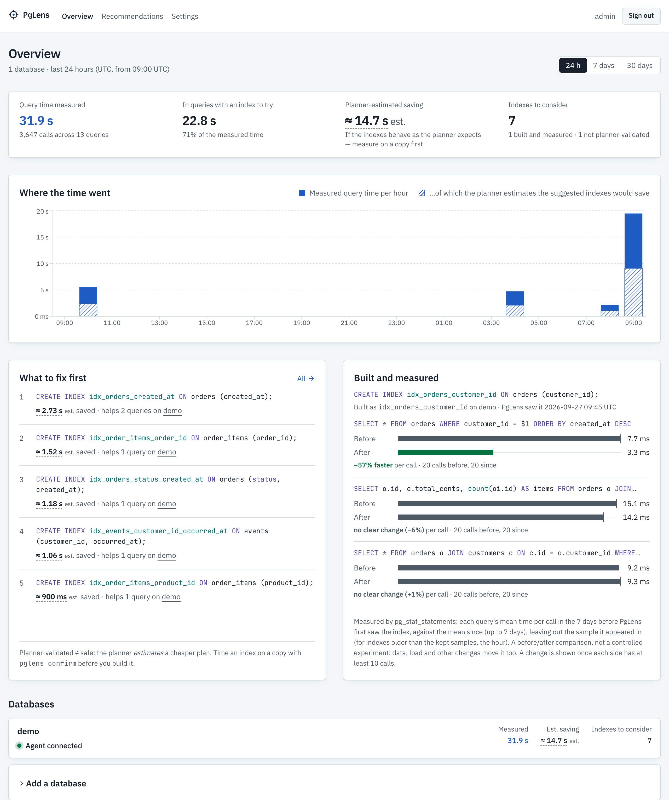
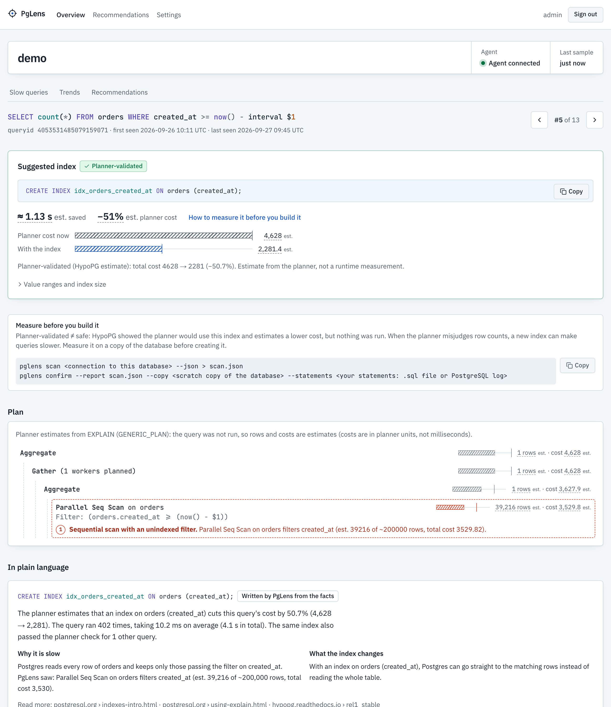
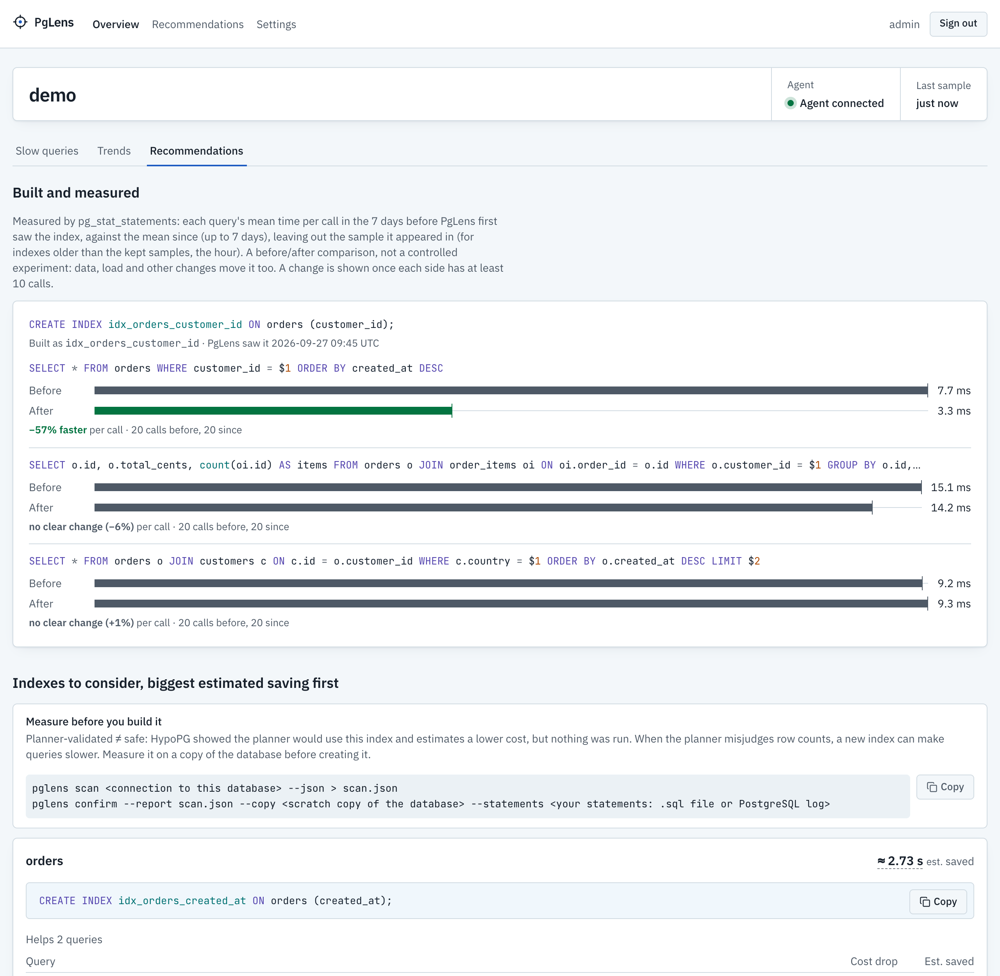
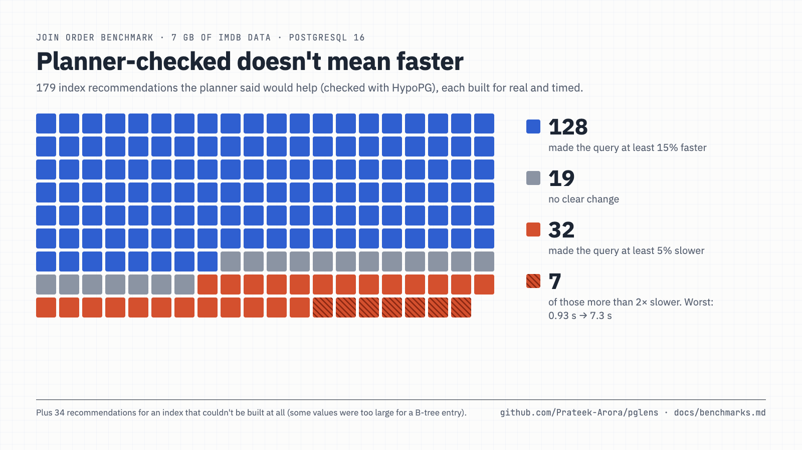

# PgLens

Find the Postgres queries that cost you the most time, the index that would fix each one, and
whether it really did.

PgLens is open source and self-hosted. It runs next to your databases, only ever reads from them,
and sends nothing anywhere else.

[](https://github.com/Prateek-Arora/pglens/actions/workflows/ci.yml)
[](LICENSE)




## What it does

An agent runs next to each database. Every minute it reads `pg_stat_statements` and sends the
numbers to the PgLens server, which:

1. Ranks your queries by the time they actually took, over the last day, week or month.
2. Reads each slow query's plan and points at the problem: a sequential scan on a selective filter,
   a join key with no index, a sort that feeds a `LIMIT`.
3. Suggests an index and asks your own planner whether it would use it, with
   [HypoPG](https://github.com/HypoPG/hypopg) hypothetical indexes. You get a `CREATE INDEX` you can
   paste as is, with the planner's estimated cost drop. Schemas, quoted names and partitioned tables
   are handled.
4. Lets you measure before you build: `pglens confirm` builds the index on a copy of your database
   and times your own statements with and without it.
5. Notices when you build it. The advice goes away, and each affected query's measured time per call
   before and after shows up on the overview.
6. Explains each suggestion in plain language, from a template or from an LLM you choose. Every
   number the model writes is checked against PgLens's own before it's shown.

Times measured on your database are drawn solid. Planner estimates are hatched and marked *est.*,
and PgLens never presents one as a speedup.

## Try it in three minutes

You need Docker with Compose, and `make`. On Windows, run it inside WSL2.

```bash
git clone https://github.com/Prateek-Arora/pglens.git && cd pglens
make up         # build and start PgLens, its own store, a demo database and its agent
make register   # register the demo database and give its agent a token
make seed       # load the demo data
make warmup     # run the slow queries (run it again a minute later: the first sample is a baseline)
grep PGLENS_ADMIN_PASSWORD deploy/compose/.env   # your password
```

Open <http://localhost:3000> and sign in as `admin`. With Docker's caches warm, the demo's slow
queries and suggested indexes showed up about three minutes after `git clone` (measured
2026-09-27). The very first run also downloads base images and builds the Java images, so it takes
longer.

To see the whole loop, build one of the suggestions and run the workload again: `make
psql-monitored`, then `CREATE INDEX ON orders (customer_id);`, then `make warmup`. Within a minute the
advice goes away and *Built and measured* shows each query's time per call before and after.

The dashboard (port 3000), the API (8080) and both databases (5433, 5434) listen on 127.0.0.1 only.
The agent port (9090) is open so agents on other machines can reach it, over TLS and with a token.
Change any port in `deploy/compose/.env`. `make down` stops everything, and `make clean` also deletes
PgLens's data.

## Watch your own databases

```bash
make up-no-demo                                            # PgLens alone, built from source
docker compose -f deploy/compose/docker-compose.yml up -d  # or the same with the released images
```

1. Prepare each database: PostgreSQL 16 or newer, `pg_stat_statements`, ideally `hypopg`, and a
   read-only role that can read your tables. [Here's the SQL](docs/operations.md#2-prepare-each-database).
2. Add it in the dashboard. *Overview → Add a database* shows the agent's token once, with a config
   file to fill in and the `docker run` command.
3. Start the agent next to the database. It only connects out to PgLens, and it never writes to
   your database.

Managed Postgres (RDS, Cloud SQL, Azure, Neon, Supabase), connection poolers, TLS and HTTPS, using
your own LLM, disk use, backups and upgrades are all in [docs/operations.md](docs/operations.md).

<table>
<tr>
<td width="50%"></td>
<td width="50%"></td>
</tr>
<tr>
<td>A query: the suggested index, how to measure it first, and the plan with the problem marked.</td>
<td>What to build, biggest estimated saving first, and what building it really did.</td>
</tr>
</table>

## How accurate is it?

"Planner-validated" means the planner estimates a cheaper plan with the index. It doesn't mean the
query will run faster. To find out how often it does, every index PgLens recommended on two public
benchmarks was built for real on a copy, and the queries were timed before and after
([docs/benchmarks.md](docs/benchmarks.md)):

| Benchmark | Recommendations that made their query ≥ 15 % faster | …that made it slower |
|---|---|---|
| TPC-H-derived (SF 0.1, uniform data) | 6 of 14 (43 %) | 4 of 14 |
| Join Order Benchmark on the real IMDB data (pre-registered) | 128 of 179 (72 %), plus 34 whose index can't be built | 32 of 179 (18 %) |



The ranking holds up better than the individual percentages: on JOB, the #1 index saved 364 of the
424 s its queries took. But when the planner misjudges row counts, a new index can make a query
slower. That's why PgLens offers a way to measure first (`pglens confirm`, on a copy you mark as
scratch) and measures again after you build.

## Related tools

PgLens isn't the first tool to check index advice with HypoPG. [Dexter](https://github.com/ankane/dexter)
is an automatic indexer that can create the indexes itself. [PoWA](https://powa.readthedocs.io/) is a
workload analyzer with index suggestions (it needs `pg_qualstats`). [pganalyze](https://pganalyze.com/)
is a hosted commercial service with an index advisor. [Postgres MCP Pro](https://github.com/crystaldba/postgres-mcp)
gives AI agents index tuning and health checks. Supabase's
[index_advisor](https://github.com/supabase/index_advisor) suggests indexes for a single query.
PgLens's focus is the whole loop on your own infrastructure: history, planner-checked advice, a way
to measure first, and a measured before and after once the index exists.

## Safety

- The agent logs in as a role with no write grant, and its connection is read-only from the moment
  it opens, so Postgres itself refuses any write. Indexes are only hypothetical and disappear when
  the session ends. If a connection pooler would share PgLens's session settings with your
  application, PgLens notices and refuses to run.
- Query text is `pg_stat_statements`' normalized form, with `$1` in place of values. Sampled values
  never leave the database session. An LLM endpoint outside your machine or network is refused
  unless you allow it.
- Dashboard passwords are bcrypt-hashed, API tokens are read-only, and agents talk to the server over
  TLS. See [SECURITY.md](SECURITY.md).
- The analysis works without any LLM. The optional model only rewords facts PgLens already has.

## More

- [The `pglens` CLI](docs/cli.md): a one-off `scan` with no server, `confirm` on a copy, and plain
  explanations, from the release image or jar.
- [The HTTP API](docs/api.md): everything the dashboard shows, as JSON, with read-only tokens
  ([OpenAPI](docs/api/openapi.json)).
- [Operations](docs/operations.md): running it for real.
- How it's built: a pure analysis engine shared by the CLI, the agent (which reads Postgres and runs
  HypoPG next to it) and the server (history, analysis, API), talking over gRPC, with a Next.js
  dashboard. See the [architecture](docs/architecture.md), the [reasoning behind each
  decision](docs/decisions.md), the [project status](docs/project.md) and the
  [changelog](CHANGELOG.md).

`make help` lists every development target, and [CONTRIBUTING.md](CONTRIBUTING.md) explains how to
contribute.

## License

[Apache-2.0](LICENSE). Attribution and third-party notices are in [NOTICE](NOTICE).
